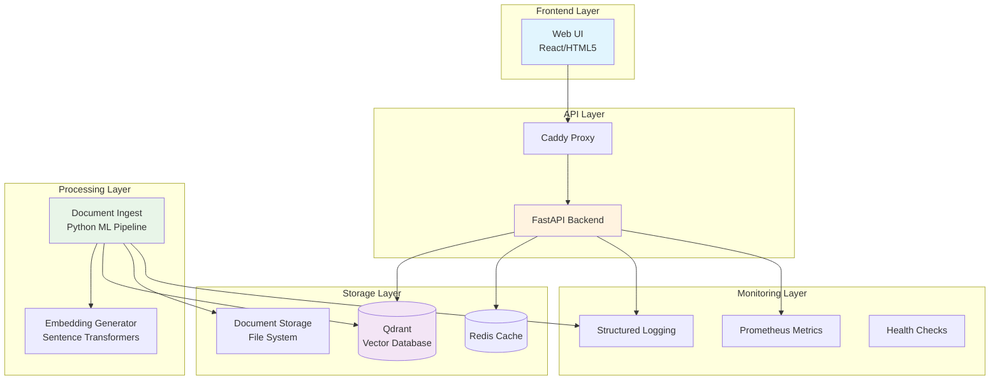

# 🧠 Knowledge Base System v2.0

> Sistema avanzato di ricerca semantica per knowledge base aziendali con tecnologie AI/ML di ultima generazione.

[](https://github.com/vcapoccia/knowledgebase)
[](LICENSE)
[](docker-compose.yml)
[](requirements.txt)

---

## 📋 Indice

- [🚀 Caratteristiche](#-caratteristiche)
- [🏗️ Architettura](#️-architettura)
- [⚡ Quick Start](#-quick-start)
- [📦 Installazione](#-installazione)
- [🔧 Configurazione](#-configurazione)
- [🎯 Utilizzo](#-utilizzo)
- [🛠️ Sviluppo](#️-sviluppo)
- [📊 Monitoraggio](#-monitoraggio)
- [🔐 Sicurezza](#-sicurezza)
- [📚 Documentazione](#-documentazione)
- [🤝 Contribuire](#-contribuire)

---

## 🚀 Caratteristiche

### ✨ **Core Features**
- 🔍 **Ricerca Semantica Avanzata** - Comprensione del contesto oltre le keyword
- 🧠 **Embeddings Neural** - Modelli transformer per rappresentazioni semantiche
- 📄 **Multi-Format Support** - PDF, DOCX, TXT, HTML, Markdown
- 🏷️ **Faceted Search** - Filtri dinamici e categorizzazione automatica
- ⚡ **Performance Ottimali** - Ricerca sub-secondo anche su milioni di documenti
- 🔄 **Processing Incrementale** - Elaborazione solo di file nuovi/modificati

### 🛡️ **Enterprise-Ready**
- 🐳 **Docker & Kubernetes** - Deploy e scaling automatico
- 📊 **Monitoring Completo** - Metriche, logs, health checks
- 🔐 **Security Built-in** - Autenticazione, autorizzazione, audit trails
- 💾 **Backup Automatici** - Strategie multiple di backup e recovery
- 🌍 **Multi-tenancy** - Supporto per organizzazioni multiple
- 📈 **Scalabilità** - Da singola VM a cluster distribuito

### 🎨 **User Experience**
- 💻 **Web UI Moderna** - Interface responsive e intuitiva
- 🌓 **Dark/Light Mode** - Temi personalizzabili
- 📱 **Mobile-First** - Ottimizzato per tutti i dispositivi
- ⚡ **Real-time Search** - Risultati istantanei durante la digitazione
- 📋 **Smart Suggestions** - Completamento automatico e suggerimenti
- 🔗 **Deep Linking** - Condivisione diretta di ricerche e risultati

---

## 🏗️ Architettura



### 🔧 **Componenti Principali**

| Componente | Tecnologia | Ruolo |
|------------|------------|--------|
| **Web UI** | HTML5/JS + TailwindCSS | Interface utente moderna |
| **API Gateway** | Caddy v2 | Reverse proxy, SSL, file serving |
| **Backend API** | FastAPI + Python 3.11 | REST API, business logic |
| **Vector DB** | Qdrant | Storage embeddings e ricerca |
| **ML Pipeline** | Sentence Transformers + PyTorch | Elaborazione documenti |
| **Cache Layer** | Redis (opzionale) | Performance optimization |
| **Monitoring** | Prometheus + Grafana | Metriche e dashboards |

---

## ⚡ Quick Start

### 🚀 **30-Second Deploy**

```bash
# 1. Clone repository
git clone https://github.com/vcapoccia/knowledgebase.git
cd knowledgebase

# 2. Run installation script
chmod +x scripts/install.sh
./scripts/install.sh

# 3. Start system
make start

# 4. Add documents and ingest
cp /path/to/your/documents docs/
make ingest

# 🎉 Open http://localhost
```

### 🏃‍♂️ **Development Mode**

```bash
# Development setup with hot-reload
make dev
make logs-api  # View API logs in another terminal
```

---

## 📦 Installazione

### 📋 **Prerequisiti**

| Requisito | Versione | Note |
|-----------|----------|------|
| **Docker** | 20.10+ | Con Docker Compose |
| **Sistema** | Linux/macOS | Ubuntu 20.04+ raccomandato |
| **RAM** | 4GB+ | 8GB+ per dataset grandi |
| **Storage** | 10GB+ | + spazio per documenti |
| **CPU** | 2+ cores | GPU opzionale per performance |

### 🔧 **Installazione Automatica**

```bash
# Download e setup completo
curl -fsSL https://raw.githubusercontent.com/vcapoccia/knowledgebase/main/scripts/install.sh | bash

# Oppure manuale
git clone https://github.com/vcapoccia/knowledgebase.git
cd knowledgebase
make install
```

### 🐳 **Installazione Docker**

```bash
# Setup tramite Docker Compose
docker-compose up -d
docker-compose run --rm kb-ingest  # Prima ingestion
```

### 🏗️ **Build da Sorgenti**

```bash
# Build custom images
make build
make start
```

---

## 🔧 Configurazione

### 📝 **File `.env` Base**

```bash
# Copia template e modifica
cp .env.example .env
nano .env
```

### ⚙️ **Configurazioni Principali**

```env
# === AMBIENTE ===
ENV=production
PROJECT_NAME=knowledgebase

# === PERCORSI ===
KB_ROOT=/home/vcapoccia/knowledgebase/docs
KB_GARE_DIR=/home/vcapoccia/knowledgebase/docs/_Gare
KB_AQ_DIR=/home/vcapoccia/knowledgebase/docs/_AQ

# === NETWORK ===
PUBLIC_BASE_URL=http://kb.local
PUBLIC_HTTP_PORT=80
PUBLIC_HTTPS_PORT=443

# === DATABASE ===
QDRANT_URL=http://qdrant:6333
QDRANT_COLLECTION=kb_chunks

# === MACHINE LEARNING ===
EMBEDDING_MODEL=sentence-transformers/all-MiniLM-L6-v2
TORCH_DEVICE=cpu  # or 'cuda' for GPU
USE_GPU=false

# === SECURITY ===
SECRET_KEY=your-secret-key-change-in-production
CORS_ORIGINS=http://localhost,http://kb.local
```

### 🎛️ **Configurazioni Avanzate**

<details>
<summary><strong>📊 Performance Tuning</strong></summary>

```env
# API Performance
KB_API_WORKERS=4
KB_API_CPU_LIMIT=2.0
KB_API_MEMORY_LIMIT=4G

# Qdrant Performance
QDRANT_CPU_LIMIT=2.0
QDRANT_MEMORY_LIMIT=4G

# Ingest Performance  
INGEST_BATCH_SIZE=100
MAX_CHUNK_SIZE=1000
CHUNK_OVERLAP=200
MAX_WORKERS=4
```

</details>

<details>
<summary><strong>🔐 Security Settings</strong></summary>

```env
# Authentication
JWT_ALGORITHM=HS256
ACCESS_TOKEN_EXPIRE_MINUTES=30

# Rate Limiting
RATE_LIMIT_ENABLED=true
RATE_LIMIT_REQUESTS=100
RATE_LIMIT_WINDOW=60

# HTTPS
SSL_CERT_PATH=/etc/ssl/certs/kb.crt
SSL_KEY_PATH=/etc/ssl/private/kb.key
```

</details>

<details>
<summary><strong>📊 Monitoring Setup</strong></summary>

```env
# Metrics
ENABLE_METRICS=true
METRICS_PORT=9090

# Logging
LOG_LEVEL=INFO
LOG_FORMAT=json
LOG_RETENTION_DAYS=30

# Health Checks
HEALTH_CHECK_INTERVAL=30
```

</details>

---

## 🎯 Utilizzo

### 🔍 **Ricerca Base**

```bash
# Via Web UI
open http://localhost

# Via API
curl -X POST http://localhost/api/search \
  -H "Content-Type: application/json" \
  -d '{"query": "contratti di fornitura", "limit": 10}'
```

### 📄 **Gestione Documenti**

```bash
# Aggiungere documenti
cp /path/to/documents/* docs/

# Eseguire ingest
make ingest

# Ingest incrementale (solo nuovi/modificati)
make ingest-incremental

# Force re-ingest tutto
make ingest-force
```

### 🎛️ **Comandi Makefile**

| Comando | Descrizione |
|---------|-------------|
| `make help` | 📚 Mostra tutti i comandi |
| `make install` | 🚀 Installazione completa |
| `make start` | ▶️  Avvia servizi |
| `make stop` | ⏹️  Ferma servizi |
| `make restart` | 🔄 Riavvia servizi |
| `make status` | 📊 Stato servizi |
| `make logs` | 📋 Visualizza logs |
| `make health` | 🏥 Health check |
| `make ingest` | 📄 Elabora documenti |
| `make backup` | 💾 Backup completo |
| `make restore` | 🔄 Ripristino |
| `make clean` | 🧹 Pulizia sistema |

### 📊 **Monitoraggio Status**

```bash
# Status completo
make status

# Health check dettagliato
make health

# Logs in tempo reale
make logs

# Logs specifici
make logs-api
make logs-ui
make logs-ingest
```

---

## 🛠️ Sviluppo

### 🚀 **Setup Ambiente Dev**

```bash
# Clone repo
git clone https://github.com/vcapoccia/knowledgebase.git
cd knowledgebase

# Setup sviluppo con hot-reload
make dev

# Logs sviluppo
make dev-logs
```

### 🏗️ **Struttura Progetto**

```
knowledgebase/
├── 📁 apps/                     # Applicazioni
│   ├── 📁 kb-api/               # FastAPI Backend
│   ├── 📁 kb-ui/                # Frontend Web
│   └── 📁 kb-ingest/            # ML Processing
├── 📁 config/                   # Configurazioni
│   ├── 📁 caddy/                # Reverse Proxy
│   ├── 📁 nginx/                # Web Server
│   └── 📁 qdrant/               # Vector DB
├── 📁 scripts/                  # Automation
│   ├── 📄 install.sh            # Installazione
│   ├── 📄 backup.sh             # Backup
│   └── 📄 health-check.sh       # Health Check
├── 📁 docs/                     # Knowledge Base
│   ├── 📁 _Gare/                # Documenti Gare
│   └── 📁 _AQ/                  # Altri Documenti
├── 📁 data/                     # Dati persistenti
│   ├── 📁 qdrant/               # DB storage
│   ├── 📁 logs/                 # Application logs
│   └── 📁 backups/              # Backup files
├── 📄 docker-compose.yml        # Servizi produzione
├── 📄 docker-compose.override.yml # Sviluppo
├── 📄 Makefile                  # Automazione
├── 📄 .env                      # Configurazioni
└── 📄 README.md                 # Questa documentazione
```

### 🧪 **Testing**

```bash
# Test completi
make test

# Test specifici
make test-api
make test-ingest

# Coverage report
make test-coverage
```

### 🔧 **Debug & Profiling**

```bash
# Debug mode
ENV=development make dev

# API debug (porta 5678)
docker exec -it kb-api python -m debugpy --listen 0.0.0.0:5678 --wait-for-client main.py

# Profiling
make profile-api
make profile-ingest
```

---

## 📊 Monitoraggio

### 📈 **Metriche & Dashboards**

```bash
# Avvia stack monitoring
make monitoring-start

# Accesso dashboards
open http://localhost:3000  # Grafana (admin/admin)
open http://localhost:9090  # Prometheus
```

### 📋 **Logs Strutturati**

```bash
# Log aggregation
make logs | jq '.level="ERROR"'

# Specific service logs
docker logs kb-api --follow
docker logs kb-ingest --tail 100
```

### 🏥 **Health Checks**

```bash
# Health check completo
curl http://localhost/api/health | jq

# Individual services
curl http://localhost:6333/health        # Qdrant
curl http://localhost:8000/health        # API
curl http://localhost:2019/config/       # Caddy
```

### 📊 **Performance Monitoring**

```bash
# Resource usage
make top

# Disk usage
make disk-usage

# System stats
make system-stats
```

---

## 🔐 Sicurezza

### 🛡️ **Security Checklist**

- [ ] ✅ **Secret Key** - Cambiato da default
- [ ] ✅ **HTTPS** - Certificati SSL configurati  
- [ ] ✅ **CORS** - Origins limitati in produzione
- [ ] ✅ **Rate Limiting** - Protezione da abuse
- [ ] ✅ **Input Validation** - Sanitizzazione input
- [ ] ✅ **File Upload** - Limitazioni tipo/dimensione
- [ ] ✅ **Access Logs** - Audit trail completo
- [ ] ✅ **Container Security** - User non-root, minimal base

### 🔒 **Autenticazione & Autorizzazione**

```python
# JWT Token example
from app.auth import create_access_token

token = create_access_token(data={"sub": "user@domain.com"})
```

### 🔑 **Gestione Secrets**

```bash
# Usando Docker Secrets
echo "my-secret-key" | docker secret create kb_secret_key -

# Usando environment file sicuro
chmod 600 .env
chown root:root .env
```

---

## 📚 Documentazione

### 📖 **API Documentation**

- 🌐 **Interactive Docs**: http://localhost/api/docs
- 📋 **ReDoc**: http://localhost/api/redoc
- 📄 **OpenAPI Spec**: http://localhost/api/openapi.json

### 📚 **Guide Dettagliate**

- [🚀 Installation Guide](docs/installation.md)
- [🔧 Configuration Reference](docs/configuration.md)
- [🔍 Search API Guide](docs/search-api.md)
- [📄 Document Processing](docs/document-processing.md)
- [🚀 Deployment Guide](docs/deployment.md)
- [🛠️ Development Setup](docs/development.md)
- [📊 Monitoring Guide](docs/monitoring.md)
- [🔐 Security Guide](docs/security.md)

### 🎓 **Tutorials**

- [Quick Start Tutorial](docs/tutorials/quickstart.md)
- [Advanced Search Features](docs/tutorials/advanced-search.md)
- [Custom Document Processors](docs/tutorials/custom-processors.md)
- [Production Deployment](docs/tutorials/production-deployment.md)

---

## 🚀 Deployment

### 🐳 **Docker Production**

```yaml
# docker-compose.prod.yml
version: '3.8'
services:
  caddy:
    image: caddy:2-alpine
    ports:
      - "80:80"
      - "443:443"
    volumes:
      - ./Caddyfile:/etc/caddy/Caddyfile
      - caddy_data:/data
      - caddy_config:/config
```

### ☸️ **Kubernetes Deployment**

```bash
# Deploy to Kubernetes
kubectl apply -f k8s/namespace.yaml
kubectl apply -f k8s/configmap.yaml
kubectl apply -f k8s/deployment.yaml
kubectl apply -f k8s/service.yaml
kubectl apply -f k8s/ingress.yaml
```

### 🌍 **Cloud Providers**

<details>
<summary><strong>🔵 Azure Container Instances</strong></summary>

```bash
# Deploy to Azure
az container create \
  --resource-group myResourceGroup \
  --name knowledgebase \
  --image vcapoccia/knowledgebase:latest \
  --ports 80 443 \
  --environment-variables ENV=production
```

</details>

<details>
<summary><strong>🟢 AWS ECS</strong></summary>

```bash
# Deploy to AWS ECS
aws ecs create-service \
  --cluster knowledgebase-cluster \
  --service-name knowledgebase-service \
  --task-definition knowledgebase:1
```

</details>

<details>
<summary><strong>🔶 Google Cloud Run</strong></summary>

```bash
# Deploy to Cloud Run
gcloud run deploy knowledgebase \
  --image gcr.io/PROJECT-ID/knowledgebase \
  --platform managed \
  --region europe-west1
```

</details>

---

## 🔄 Backup & Recovery

### 💾 **Backup Automatico**

```bash
# Backup completo
make backup

# Backup programmato (cron)
0 2 * * * /home/vcapoccia/knowledgebase/scripts/backup.sh
```

### 🔄 **Ripristino**

```bash
# Lista backup disponibili
make list-backups

# Ripristino da backup specifico
make restore BACKUP=backup_20231125_143000

# Ripristino interattivo
make restore
```

### ☁️ **Backup Cloud**

```bash
# Sync to cloud storage
export BACKUP_REMOTE_HOST=backup.domain.com
export BACKUP_REMOTE_PATH=/backups/knowledgebase
export BACKUP_REMOTE_USER=backup

make backup  # Automaticamente synca to remote
```

---

## 🛠️ Troubleshooting

### ❓ **Problemi Comuni**

<details>
<summary><strong>🐳 Docker non parte</strong></summary>

```bash
# Check Docker daemon
systemctl status docker
sudo systemctl start docker

# Check Docker Compose
docker-compose version
```

</details>

<details>
<summary><strong>📡 Qdrant connection error</strong></summary>

```bash
# Check Qdrant status
curl http://localhost:6333/health

# Restart Qdrant
docker-compose restart qdrant

# Check logs
docker logs kb-qdrant
```

</details>

<details>
<summary><strong>🔍 Search non funziona</strong></summary>

```bash
# Check API health
curl http://localhost/api/health

# Check ingest status
make status

# Re-run ingest
make ingest-force
```

</details>

<details>
<summary><strong>💾 Spazio disco insufficiente</strong></summary>

```bash
# Check disk usage
make disk-usage

# Clean docker artifacts
make clean

# Archive old backups
find data/backups -mtime +30 -delete
```

</details>

### 🔍 **Log Analysis**

```bash
# Error analysis
make logs | grep ERROR | jq

# Performance analysis  
make logs | grep "slow_query" | jq

# Search analytics
make logs | grep "search_request" | jq '.duration'
```

### 📞 **Support**

- 🐛 **Bug Reports**: [GitHub Issues](https://github.com/vcapoccia/knowledgebase/issues)
- 💬 **Discussions**: [GitHub Discussions](https://github.com/vcapoccia/knowledgebase/discussions)  
- 📧 **Email**: vcapoccia@domain.com
- 💬 **Slack**: #knowledgebase-support

---

## 🤝 Contribuire

### 👥 **Come Contribuire**

1. 🍴 Fork del repository
2. 🌿 Crea feature branch (`git checkout -b feature/amazing-feature`)
3. ✅ Aggiungi tests per le nuove funzionalità
4. 📝 Commit delle modifiche (`git commit -m 'Add amazing feature'`)
5. 📤 Push al branch (`git push origin feature/amazing-feature`)
6. 🎯 Crea Pull Request

### 📋 **Guidelines**

- ✅ Segui lo stile di codice esistente
- 📝 Documenta le nuove funzionalità
- 🧪 Aggiungi test per il codice nuovo
- 📄 Aggiorna README se necessario
- 🔍 Testa in ambiente locale prima di PR

### 🧪 **Development Workflow**

```bash
# Setup development environment
make dev-setup

# Run tests before committing
make test

# Check code quality
make lint
make format

# Build and test containers
make build
make test-integration
```

---

## 📄 Licenza

Questo progetto è licenziato sotto la **MIT License** - vedi il file [LICENSE](LICENSE) per i dettagli.

---

## 🙏 Ringraziamenti

- 🤗 **Hugging Face** - Per i modelli Sentence Transformers
- 🔍 **Qdrant** - Per il vector database 
- ⚡ **FastAPI** - Per il framework web moderno
- 🐳 **Docker** - Per la containerizzazione
- 🎨 **TailwindCSS** - Per lo styling moderno

---

## 📊 Statistiche Progetto


---

<div align="center">

### 🌟 Se questo progetto ti è utile, lascia una ⭐ star!

**[⬆ Torna all'inizio](#-knowledge-base-system-v20)**

---

*Realizzato con ❤️ da [vcapoccia](https://github.com/vcapoccia)*

</div>